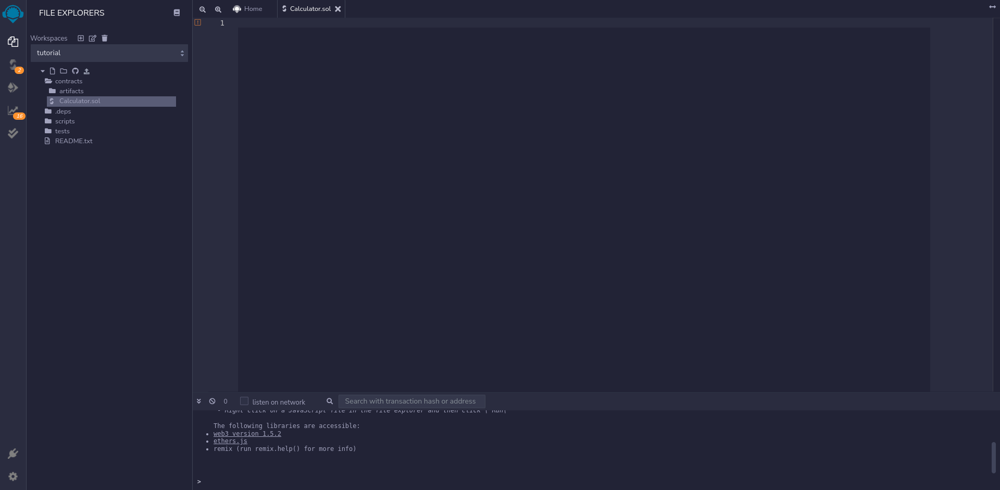

## What is Solidity?

Solidity is a high-level, object-oriented language inspired by JavaScript, C++, and Python - it has syntax very similar to JavaScript. It is used to write smart contracts.

## Setting up the dev environment

We will be using [Remix - Ethereum IDE](https://remix.ethereum.org/) for this demonstration. Click the contract folder from the file explorer and delete all the existing files. Then create a new file by clicking the file icon above the contracts folder icon. Name the file Calculator.sol (you can name it whatever you like).


We can begin writing the contract in the editor.



## Your first Smart contract

Now, let's write a simple smart contract. We will be building a simple calculator (not the best use case of a smart contract).

```js
// SPDX-License-Identifier: MIT
pragma solidity >=0.7.0 <0.9.0;
```

_Line 1_: Specifying [SPDX license](https://spdx.org/licenses/) type, which is an addition after Solidity ^0.6.8; whenever the source code of a smart contract is made available to the public, these licenses can help resolve/avoid copyright issues. If you do not wish to specify any license type, you can use a special value UNLICENSED or simply skip the whole comment (it won’t result in an error, just a warning).

_Line 2_: On the first line we are declaring which Solidity compiler we want to use.

```js
// SPDX-License-Identifier: UNLICENSED
pragma solidity >=0.7.0 <0.9.0;

contract Calculator {

}
```

Solidity's code is encapsulated in contracts. A contract is the fundamental building block of Ethereum applications — all variables and functions belong to a contract.

We are declaring our contract here and naming it as **Calculator**. It is normal practice to use the same filename as the contract name. For example - this contract will be saved in the file name Calculator.sol (.sol is the file extension for solidity smart contracts).

```js
// SPDX-License-Identifier: UNLICENSED
pragma solidity >=0.7.0 <0.9.0;

contract Calculator {
    uint result;

    function add(uint x, uint y) public {
        result = x + y;
    }
}
```

We are declaring a uint (Unsigned Integer) variable named result, this variable will be used to store the result of the arithmetic operations. State variables are permanently stored in contract storage. This means they're written to the Ethereum blockchain.

The `uint` data type is an unsigned integer, meaning its value must be non-negative. There's also an `int` data type for signed integers.

> Note: In Solidity, `uint` is actually an alias for `uint256`, a 256-bit unsigned integer. You can declare uints with less bits — `uint8`, `uint16`, `uint32`, etc.

Next we are creating function called **add**. It accepts two parameters of type `uint`

> As with function parameters, it's convention to start private function names with an underscore (\_).

This function adds the two parameters and stores it the the result variable we defined above.
You must be wondering what does `public` mean. It is called an access modifier. The function is marked as `public` which means that the function can be called by anyone.

```js
// SPDX-License-Identifier: UNLICENSED
pragma solidity >=0.7.0 <0.9.0;

contract Calculator {
    uint result;

    function add(uint x, uint y) public {
        result = x + y;
    }

    function sub(uint x, uint y) public {
        result = x - y;
    }

    function multiply(uint x, uint y) public {
        result = x * y;
    }

    function devide(uint x, uint y) public {
        result = x / y;
    }
}
```

Similarly create functions for subtraction, multiplication and division.
But we have a problem in division function. What if `y` is equal to `0`. It will result in an error.

```js
// SPDX-License-Identifier: UNLICENSED
pragma solidity >=0.7.0 <0.9.0;

contract Calculator {
    uint result;

    function add(uint x, uint y) public {
        result = x + y;
    }

    function sub(uint x, uint y) public {
        result = x - y;
    }

    function multiply(uint x, uint y) public {
        result = x * y;
    }

    function devide(uint x, uint y) public {
        require(y!=0,'Division by zero not possible');
        result = x / y;
    }
}
```

To tackle this problem we will use the `require` statement.
`require` makes it so that the function will throw an error and stop executing if some condition is not true. So here if `y` is 0, it will throw an error saying `Division by zero not possible`.

```js
function get() public view returns (uint) {
        return result;
}
```

Finally we will add a function `get` to get the value of result. It will be a `public` function, i.e, anyone can call this function. This function is also marked with the `view` modifier, meaning it's only viewing the data but not modifying it.
Also if a function returns something we need to specify the datatype it returns. We do that by saying `returns (uint)`.

Congratulations!!!
You have written your first smart contract. All that is left is to deploy it and see it in action.

```js
// SPDX-License-Identifier: UNLICENSED
pragma solidity >=0.7.0 <0.9.0;

contract SimpleStorage {
    uint result;

    function add(uint x, uint y) public {
        result = x + y;
    }

    function sub(uint x, uint y) public {
        result = x - y;
    }

    function multiply(uint x, uint y) public {
        result = x * y;
    }

    function devide(uint x, uint y) public {
        require(y!=0,'Division by zero not possible');
        result = x / y;
    }

    function get() public view returns (uint) {
        return result;
    }
}
```

## Deploying your smart contract

Head over to the side bar and click on the solidity compiler.


Leave the settings as shown in the image above and click on compile Calculator.sol.
Next, in the sidebar click on the "deploy and run transactions" icon.


Leave the settings as default and click on deploy.
After it has deployed you will get a message in the console below with a green check mark. Also your contract will be listed in the deployed contract section in the sidebar from where you can interact with your smart contract.


You can interact with the deployed contract now. All the public functions will be listed there.


Enter the parameters and click on `add`. You will get a green check mark in the console which shows that the transaction was successful. Any function call in a blockchain will cause a transaction in the blockchain and will cost money (except for view and pure function if they are called externally).


Now click on `get`. You will get the result displayed below the get function like this `0:uint256: 30`. You will also notice that in the console there is not green check mark. This means that there was no transaction initiated in the blockchain (since this was a view function and called externally).


Now lets try dividing by 0. It will throw an error. If you notice the error it say "Division by zero not possible" same as we provided in the `require` statement in our smart contract. Clicking on get will still get `0:uint256: 30`.


All the other functions work similar to the `add` function.
Well that was it folks. Pat yourself on the back if you stuck through the entire tutorial. You have successfully programmed and deployed your smart contract. With this you can start your blockchain journey and make a name for yourself.
